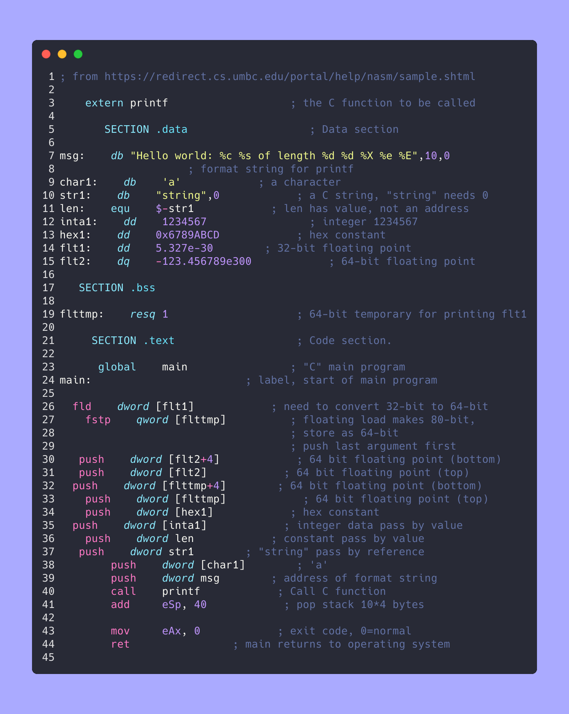
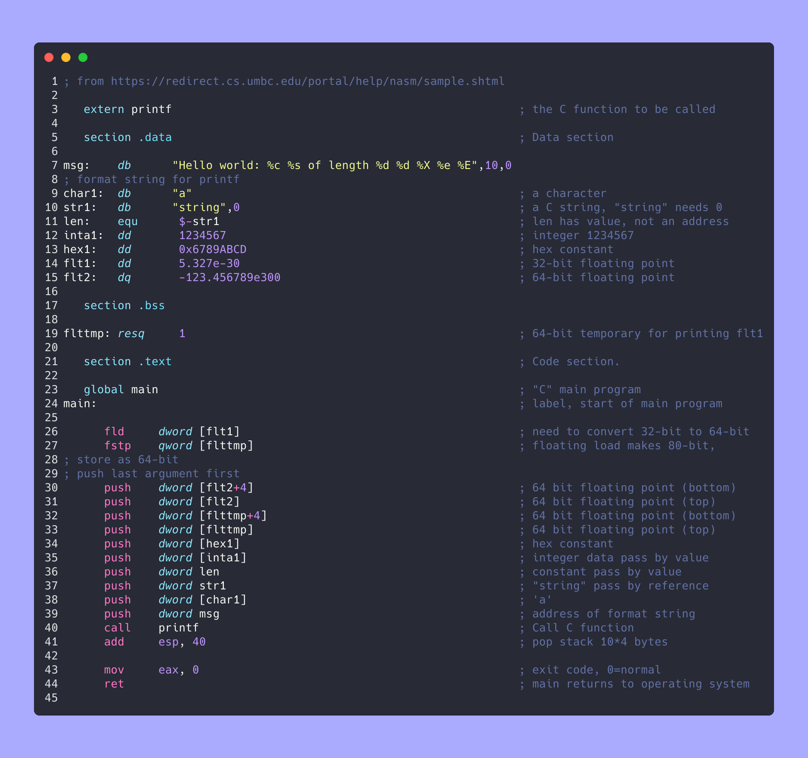

# asmfmt

Formatter for NASM-Style Assembly

## Features

|               before               |              after               |
| :--------------------------------: | :------------------------------: |
|  |  |

## Installation

You need to have a more or less current rust toolchain. Run the following commands in your shell:

```bash
git clone https://github.com/HSMF/asmfmt; cd asmfmt
cargo install --path .
```

## Usage

run `asmfmt [FILE]`. If FILE is not specified, asmfmt reads from stdin.

```bash
> cat program.asm
global _start

_start: ; entry point
    mov eax, 5
st:
    ret
> asmfmt program.asm # formats program.asm
```

## In Editors

### Neovim

The recommended way of including asmfmt in Neovim is by using [null-ls](https://github.com/jose-elias-alvarez/null-ls.nvim)

```lua
local asmfmt = {
    method = require("null-ls").methods.FORMATTING,
    filetypes = { "asm" },
    generator = null_ls.formatter({
        command = "asmfmt",
        to_stdin = true,
    }),
}

require("null-ls").setup({
    sources = {
        asmfmt,
        -- other sources...
    }
})
```

### VSCode

Use [this extension](./asmfmt-vsc/)

### Others

- if your editor is not supported and you know how to support it, please submit a PR. Thanks!

## Configuration

The configuration for `asmfmt` is a yaml file that can be specified via `--config <CONFIG_FILE>`

The default configuration looks something like this:

```yaml
# place this in config.yaml
use_tabs: false                 # whether to tabs to indent
shift_only_comments: false      # whether to align lines that are only comments
align_operands:                 # how to align normal instructions
  min_spaces_after_label: 1
  min_spaces_after_instr: 4
align_pseudo_ops:               # how to align pseudo instructions (such as DB)
  min_spaces_after_label: 1
  min_spaces_after_instr: 4
uppercase_tokens: []            # which tokens are to be made uppercase
indent_directives: 4            # how far to indent directives
```


